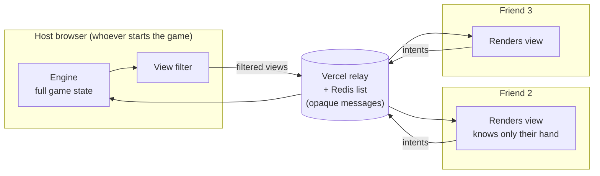

# Jlore Jlards — Architecture

How this thing is built and why. Written for a hobby project: **me and 2–3 friends, playing from different houses, nobody is attacking it.**

---

## 1. Scope

**Goals**

- 2–4 people play a game of Jlore Jlards from different locations.
- You can't see your opponent's hand or anybody's library by just looking at the screen or poking around devtools.
- Someone shares a link in Discord, everyone clicks it, game starts. No accounts.
- I can add and tweak cards without touching engine code.

**Explicit non-goals** — these are not "later", they're *no*:

| Not doing | Why |
|---|---|
| Anti-cheat | It's my friends. If someone reverse-engineers the relay protocol to peek at my library, they've earned it. |
| Accounts, login, auth | A room code in a URL is the entire identity system. |
| Matchmaking, lobbies, ranked, chat | We're already in a Discord call. |
| Server-authoritative rules | Doubles the work for a threat model that doesn't exist here. |
| Spectators, replays, tournaments | No. |
| Mobile-first layout | Desktop browser. If it works on a phone, nice. |
| Scaling | Peak concurrency is 4. |

**The one hard requirement that shapes everything:** hidden information should be *actually absent* from a non-host player's browser, not just hidden by CSS. That's cheap to achieve and it's the difference between a card game and a spreadsheet.

---

## 2. The whole idea in one picture

One browser — the host's — runs the game. Everyone else runs a dumb terminal that renders whatever it's told and sends button presses back. The server is a message queue that has no idea what a card is.



**Why this gets the hidden-info property for free:** Friend 2's browser is never *sent* the library or Friend 3's hand. There's nothing to find in devtools because the data never crossed the wire. No encryption, no validation, no auth — just don't send it.

The host sees everything, obviously. The host is a person I know.

---

## 3. What runs where

| Piece | Where | Notes |
|---|---|---|
| Rules engine | Host's browser | Pure function, no I/O |
| Card definitions | Bundled with the client | Static JSON, ~400 cards |
| View filtering | Host's browser | Runs after every state change |
| Message relay | Vercel Function + Redis | ~40 lines, knows nothing about the game |
| Rendering + input | Every browser | Same client code; host just also runs the engine |
| Codex / settings | Each browser's localStorage | Never leaves the device |
| Seat identity | A cookie | So a refresh puts you back in your seat |

---

## 4. The engine

Everything good about this architecture comes from one decision: **the engine is a pure function with no I/O, no framework, no network awareness.**

```js
// engine/index.js
export function reduce(state, action, rng) -> newState
```

That's the whole public surface. It doesn't know it's in a browser, doesn't know there are other players, doesn't fetch anything. Consequences:

- **Testable without any infrastructure.** Feed it an action list, assert on the state. No mocks, no server running.
- **Hotseat works before multiplayer exists.** Same function, one browser, no relay.
- **Multiplayer is a transport swap.** If I ever want a real server, the same `reduce` moves into the Vercel function untouched.
- **Bugs are reproducible.** Which, with this card pool, is the actual reason.

### 4.1 Seeded randomness — non-negotiable

**No `Math.random()` anywhere in `engine/`.** Ever. Every random pull goes through the injected `rng`: Egg drop tables, Grapevine's 79/20/1 split, Highroller flips, Lead's per-turn cost reroll, Too Many Stats, and every "random card from the Entire Universe."

The reason isn't security here — it's that "the Grapevine did something weird and then Misery replayed it" is completely unreproducible otherwise, and I will hit that constantly. With a seed, I paste `(seed, actionLog)` into a test and watch it happen again.

```js
// engine/rng.js — mulberry32, ~5 lines, deterministic
export function makeRng(seed) { /* ... */ }
```

Add an ESLint rule banning `Math.random` under `engine/`. It will save an evening.

### 4.2 State shape

```js
{
  seed, turn, activePlayer,
  players: {
    [id]: { library:[], hand:[], gy:[], play:[], field:[],
            money, buys, actions, prophet, vp }
  },
  shop:    { resource:{}, points:{}, prophet:{}, draft:[ /* 10 piles */ ] },
  anomaly: null | AnomalyId,
  pending: null | { type:'discover', player, options, prompt },
  log:     [ /* every action, in order */ ]
}
```

Cards in zones are **instances**, not IDs — they carry their own counters (Plague tokens, Lection's play count, Relic upgrades, per-instance VP) and flags (Flimsy, Temporary). That's the three-level identity model from the design doc; skipping it means Universal Buff! and Quick Patch can't coexist.

### 4.3 Prompts are state, not callbacks

~60 cards Discover. The engine can't `await` a click. So a prompt is a **field in the state**:

```js
state.pending = { type:'discover', player:'p2', options:[a,b,c] }
```

The engine returns with `pending` set and stops. The UI sees it and renders a picker. The choice comes back as a normal action (`{type:'resolve', choice:1}`) and `reduce` continues. Same mechanism whether the picker is local or three states away — which is why multiplayer doesn't need special-casing for card prompts.

---

## 5. The view filter

The only security in the system, and it's about 30 lines.

```js
// engine/view.js
export function viewFor(state, playerId) {
  return {
    you: {
      hand:    state.players[playerId].hand,      // full detail
      field:   state.players[playerId].field,
      money, buys, actions, prophet, vp,
      libraryCount: state.players[playerId].library.length,   // count only
      gy:      state.players[playerId].gy,        // public anyway
    },
    others: mapValues(otherPlayers, p => ({
      handCount:    p.hand.length,                // count only
      libraryCount: p.library.length,             // count only
      gy: p.gy, field: p.field, vp: p.vp, ...     // public
    })),
    shop: state.shop,                              // fully public
    turn, activePlayer, anomaly,
    pending: state.pending?.player === playerId ? state.pending : { waitingOn: state.pending?.player }
  };
}
```

**Rules I'm enforcing here:**

- Libraries are counts, never contents. Not even your own — otherwise the whole draw mechanic is pointless.
- Other players' hands are counts.
- `pending` only ships its options to the player who has to choose. Otherwise a Discover leaks three cards to everyone.
- Ascendant Spread's secret VP value stays a number only its owner sees.
- The Call to Chaos "add an unknown card to the top of your library" entries send the *display text*, never the resolved card. Four different outcomes share one string on purpose.

One test worth writing and never deleting:

```js
test('a view never contains library contents', () => {
  const v = viewFor(state, 'p2');
  expect(JSON.stringify(v)).not.toContain(secretCardInP3Library.instanceId);
});
```

---

## 6. The relay

A message queue that has never heard of a card game.

```
POST /api/room/[code]     → RPUSH msg, EXPIRE 6h, return new length
GET  /api/room/[code]?since=N → LRANGE N..-1
```

That's the entire backend. Vercel Function + Upstash Redis, both free tier. Messages are opaque JSON blobs; the relay doesn't parse them, doesn't validate them, doesn't know who's the host.

**Message envelope:**

```js
{ seq, from: seatId, kind: 'intent' | 'view' | 'hello' | 'snapshot', payload }
```

- `intent` — a player pressed a button. Any seat → host.
- `view` — host → one seat, that seat's filtered view. (Yes, addressed views ride the same shared list. Any client *could* read another's view off the queue if it wanted to. That's the "if they wanted to, that's fine" tier of privacy — it takes deliberate effort and a devtools session, which is exactly the bar.)
- `hello` — a seat joined or refreshed; host replies with a fresh view.
- `snapshot` — see §8.

**Polling, not WebSockets.** One request per second. The game is turn-based; nobody notices, and it eliminates connection lifecycle, reconnect logic, and the Hobby-tier function duration cap entirely. WebSockets are available on Vercel now but they'd add real complexity for zero perceptible benefit at 4 players taking 30-second turns.

Backoff to 3s when the tab is hidden. Stop when it's been idle 10 minutes.

### Why not WebRTC

Trystero/PeerJS would remove the relay entirely and run on GitHub Pages. Skipping it because WebRTC fails on some home and corporate networks in ways that are opaque to debug — and "Dave can't join and neither of us knows why" is a worse problem for a casual game than paying $0 for a Vercel function. The relay works on every network, always.

---

## 7. Browser storage

Three tiers, and the split matters more than it looks.

| What | Where | Size | Why there |
|---|---|---|---|
| Seat token + room code | **Cookie** | ~100 bytes | Survives refresh, so reloading puts you back in your seat instead of joining as a new player. Small enough that riding along on every relay request costs nothing. |
| Codex (seen cards), settings, last snapshot | **localStorage** | KBs–MBs | Persistent, per-device, and **never sent anywhere**. |
| Live game state | **In memory** | — | Rebuilt from the host each time. Nothing to persist. |

**On putting the library in a cookie specifically:** don't. Cookies cap around 4KB and get attached to *every single HTTP request*, so a 40-card library would be shipped to the relay a thousand times a session — the opposite of private. localStorage holds 5MB and never leaves the browser on its own. Use the cookie for identity, localStorage for data.

```js
// storage.js
setCookie('jlore_seat', seatId, { maxAge: 60*60*8, sameSite: 'Lax' });

localStorage.setItem('jlore_codex', JSON.stringify([...seenCardIds]));
localStorage.setItem('jlore_snapshot', JSON.stringify({ code, seq, state }));
```

**Codex / Known Universe** lives entirely in localStorage. It's a set of card IDs, appended whenever a card appears in a match you're in. ~60 cards Discover from "the Known Universe," so the engine needs it synchronously — the host reads each seat's Codex once at match start (sent up in `hello`) and caches it in match state. Clearing your browser resets your Codex; for a hobby build that's a fine tradeoff against building account storage.

---

## 8. Room lifecycle

**Starting:** host generates a 6-char code, seeds the RNG, opens `#JLORE-4821`, pastes it in Discord.

**Joining:** open the link → client sends `hello` with your seat token (from cookie, or freshly generated) and Codex → host assigns a seat and pushes back a view.

**Refresh:** cookie restores your seat token, `hello` gets you a fresh view, you're back where you were. Takes about a second.

**Host closes the tab:** the game is gone. This is accepted. Sessions run an hour, the host is me, and if it dies we restart.

**Optional mitigation** (build only if it actually becomes annoying): the host pushes a `snapshot` message with the serialized state each turn. Any other client can then take over as host from the last snapshot. Note this does put the full state on the relay in a form a determined person could fetch and parse — which, again, is the stated privacy bar.

---

## 9. A turn, end to end

1. Friend 2 clicks "play Temple Marketplace."
2. Their client `POST`s `{kind:'intent', payload:{type:'play', instanceId}}`.
3. Host's next poll picks it up.
4. Host runs `reduce(state, action, rng)`.
5. New state has `pending: {type:'discover', player:'p2', options:[...]}`.
6. Host computes `viewFor(state, seat)` for each seat and POSTs three `view` messages.
7. Friend 2's client renders the Discover picker. Friends 1 and 3 see "waiting on Friend 2."
8. Friend 2 picks → `{kind:'intent', payload:{type:'resolve', choice:1}}` → back to step 3.

Total latency: two poll intervals, so ~1–2 seconds. Fine for a turn-based game.

---

## 10. Repo layout

```
/engine           ← pure, no I/O, no React, no fetch
  index.js          reduce()
  rng.js            seeded PRNG
  view.js           viewFor()
  effects/          the effect-node interpreter
  zones.js, shop.js, prophet.js, auras.js
/cards
  *.json            card definitions, data only
  schema.json
/net
  relay.js          poll loop + POST
  host.js           runs the engine, publishes views
  client.js         renders views, sends intents
/ui                 React components
/api
  room/[code].js    the entire backend
/test
  engine.test.js
  view.test.js      ← the leak test from §5
```

The boundary that matters: **nothing in `/engine` imports from `/net`, `/ui`, or `/api`.** Enforce it with an import lint rule. That boundary is what keeps the transport swappable and the tests trivial.

---

## 11. Cards as data

~400 cards. Hand-scripting each one doesn't work, so cards are JSON and the engine interprets them.

```jsonc
{
  "id": "temple_marketplace",
  "cost": { "money": 6 },
  "types": ["Action"],
  "rarity": "rare",
  "keywords": [],
  "stats": { "actions":1, "buys":1, "cards":1, "money":1, "prophet":1 },
  "effects": []
}
```

**`stats` is separate from `effects` on purpose.** Buff/Nerf picks a random base stat and ±1s it — if "+1 Money" is buried inside a scripted effect blob, Buff can't find it. Plain stat lines go in the structured object; only non-stat behaviour goes in `effects`.

Add cards by adding JSON. No engine changes unless a card needs a genuinely new effect op.

---

## 12. Build order

Each step is playable on its own, which is the point.

| Step | What | Feels like |
|---|---|---|
| 1 | Engine + ~40 cards + hotseat in one browser | A real (small) game |
| 2 | Relay + host/client split + view filter | Actually playing with friends |
| 3 | Add cards in bulk | The game fills out |
| 4 | Prophet shop, Auras, Anomalies | The interesting parts |
| 5 | Whatever's still fun to build | — |

**Vertical slice for step 1:** the Felinor cards. ~15 of them, covering tokens, trash triggers, giving cards to opponents, and a Points payoff — enough to shake out core-engine bugs before there are 400 cards to regress.

**Deliberately deferred, probably forever:** Fusion (Matchmaker, Freaky Phil, What is Love?, Frankenstein), the blind auction (Glubby Gloob), the "reality where you win" cards (Infinite Realities, Second Time Around, Zephrys), Arc of the Universe, Counting Cards, A Duel of Wits. Together they're a disproportionate share of total build cost for ~10 cards. Ship without them.

---

## 13. Known weaknesses, accepted

| Weakness | Why it's fine |
|---|---|
| Host closes tab → game over | It's an hour-long session with people I'm on a call with |
| Host's browser can see all state | The host is a person I know |
| A determined player could read others' views off the relay queue | Requires deliberate devtools work; that's the stated bar |
| Host does all the compute | Peak is 4 players and a few hundred effect nodes |
| Clearing browser data wipes your Codex | Building account storage costs more than it's worth here |
| No reconnect if the *relay* dies | Vercel + Upstash going down mid-session is not my problem to solve |

**If the host-dependency ever gets annoying**, the upgrade path is short: move `reduce` into `/api/room/[code].js`, keep state in Redis, and the server becomes authoritative. Same engine code, unchanged. That's the entire dividend from writing it as a pure function.
